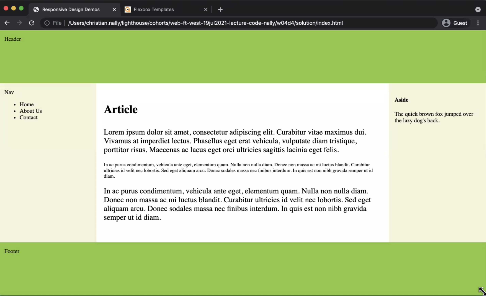
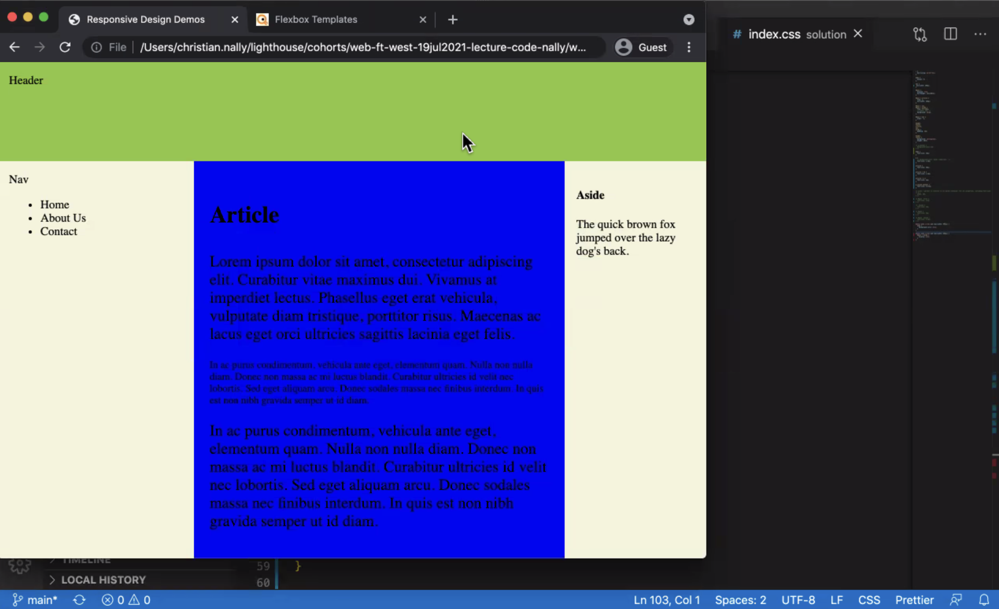

# W4D4 Notes

## Viewport
- Always add viewport to scale font in different screen sizes
```html
<head>
<meta name ="viewport" content="width=device-width, initial-scale=1.0" />
```

## Relative Units
- specify width relative to something
  1. em: relative to size of the parent
    - padding is good to have about 1 letter size width (parent)
    - ex) 1-1.5 em
  2. rem: relative to size of the root element
  3. vw: relative to 1% of the entire viewport width
    - 30vw = 30% 
  4. vh: relative to 1% of the viewport's height
  5. %: relative to percentage of the parent size (w, h, font size)

## Using flexbox templates (CSS)
- best practices: 
  - box-sizing: border-box
```css
body {
  font-size: 20px;
}

/* relative 1.3em bigger than the parent */
p {
  font-size: 1.3em 
}

article {
  font-size: 20px;
}

article > h3 {
  font-size: 1.5em
}

article > p {
  font-size: 1em;
}

/* breaking the parent and relative to the root. remaining stays the same. Whatever happens to the parent's font size, it will still keep rem */
p.second.another {
  font-size: 0.5 rem;
}

/* this will get rid of the 'aside' when the browser gets smaller than 850px breakpoint */
@media only screen and (max-width: 850px) {
  #main > sized {
    display: none;
  }
}

@media only screen and (max-width: 992px) {
  body {
    background-color: blue;
  }
}

/* print view */ 
@media print {

}


```
- styling of the above css

- Media only 992px


## SASS
- Syntactically Awesome Style Sheets

```scss
// You can preset a value (it's like a branding guide)
$font-color: lightblue;
$head-color: #24a51a;
$body-color: #34a51a;
$nav-text-color: #34a51a;
$footer-text-color: #34a51a;

// Instead of specifically typing down each color, we can use the variables
p {
  color: $font-color;
}

// Nesting (regular css)
.comtainer > p {
  color: magenta;
  text-decoration: underline;
}
.container div {
  border: 1px solid black;
}

// Nesting (SASS)
.container {
  p {
    color: magenta;
    text-decoration: underline;
  }
  div {
    border: 1px solid black;
  }
}
```

You can export/import scss file
```scss
// inside _variables.scss
$border-width: 2px;
$border-color: blue; 

// inside styles.scss
@import 'variables';
p {
  border: $border-width solid $border-color;
}
```

Extending: 
```scss
// You can also extend a tag
.header-text {
  font-size: 2em;
  font-familt: 'sans-serif';
}

.heading {
  @extend .header-text;
  color: rebeccapurble; 
}
```

Mixin
```scss
// declare the mixin
@mixin header-styles {
  height: 50px
  background-color: $header-bg;
}
header {
  @include header-styles();
}

//---------------------------------
//mixins can take parameters 
@mixin box-sizes($n) {
  height: $n;
  width: $n;
  line-height: $n;
}
.box {
  @include box-sizes(15px);
  border: 1px solid green;
}
```

## Typical Responsive Web Design Patterns
- https://developers.google.com/web/fundamentals/design-and-ux/responsive/patterns

1. Mostly Fluid
    - Grids stacks vertically
    - Width: 600, 800px
2. Column Drop
    - Columns stacks vertically depending on the content width size
3. Layout Shifter
    - Most responsive
    - Layout doesn't just shift vertically. When it's wide, there's a layout, as it narrows, layout stacks vertically
4. Tiny Tweaks
    - simply resizing everything depending on the size. Ideal for one page structure
5. Off Canvas
    - less important gets off canvas when it's small. It'll appear with a click

## How to use SASS
1. 